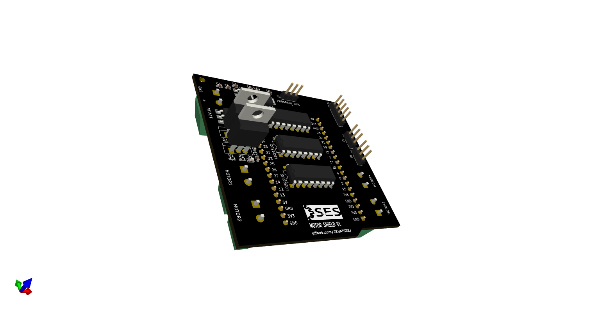
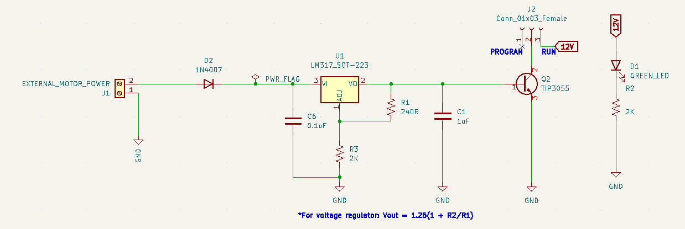
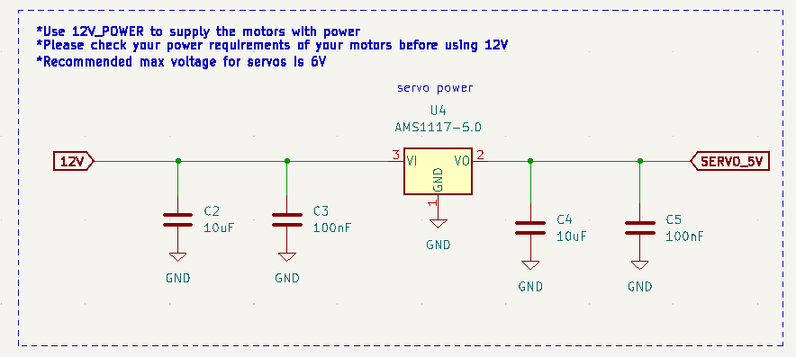
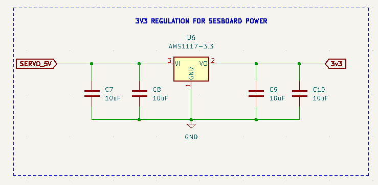
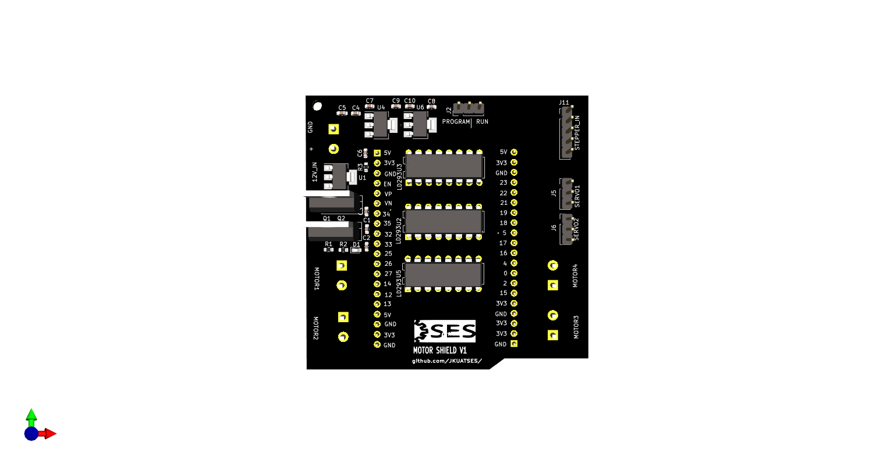
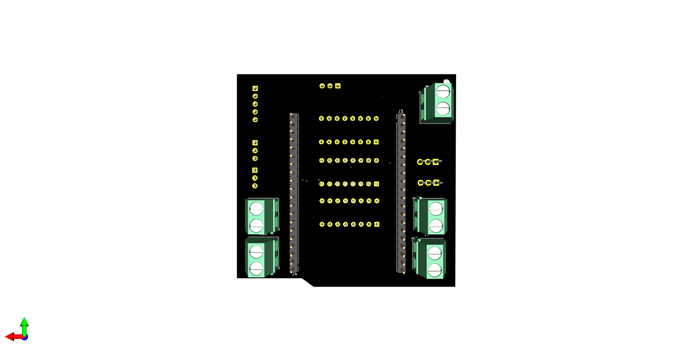
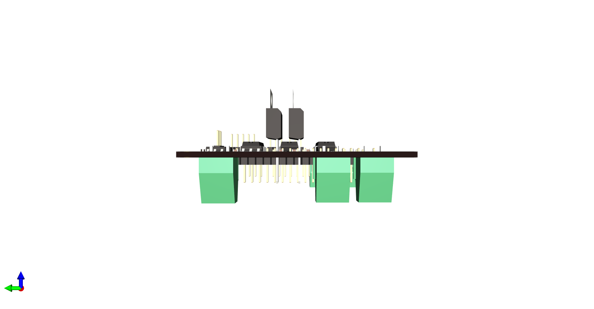

# SES-Board Motor Shield


---
The SES-Board Motor Shield features several outputs that can be useful to 
run motors for your projects needs. It features the following:
1. 2 servo motor control outputs
2. 4 DC motor control outputs
3. 1 stepper motor control output
4. External power supply
5. GPIO pins extension allowance
6. 3 LD293 Motor Driver ICs for high-current motor control
7. NEMA 17 stepper motor control 

The GPIO pins can be uses to connect to other sensors or outputs
you might want to control

# SES-Board Motor Shield Pin Assignments
The following table describes the pin assignment for each component
of the SES-Board motor shield:

| COMPONENT | PIN ON SESBOARD|
|-----------|---|
|**DC Motor 1**
|IN1|34|
|IN2|35|
|IN3|32|
|IN4|33|
|ENA|25|
|ENB|26|
|**DC Motor 2**| 
IN5|23|
|IN6|22|
|IN7|21|
|IN8|19|
|ENC|18|
|END|5|
|**Servo 1**
|SIG|17|
|Servo 2|
| SIG|16|
|**Stepper Motor**|
|A+|12|
|A-|13|
|B+|14|
|B-|15|

*** For ESP32, pins 34-39 cannot support PWM***

## Design 
### 1. Power supply
Power is derived from 12VDC supply. Because majority of motors run within this range,
this 12V is used to supply the motors with power. A 2-terminal block is used
to receive this 12V input. It then passes through a rectifier diode connected in forward bias 
to prevent reverse polarity damage. The diode drops 0.7V forward voltage.  
An LM317 voltage regulator is placed on the line for regulation. R1=240R and R2=2K. R1 and R2 ensure we get an output
of 12V regulated. Vout is given by this formula:
```c
Vout = 1.25(1 + R2/R1)
```

An NPN transistor (TIP3055), is connected to allow the shield to handle large current values when running.
A jumper is then placed at the collector of the transistor to allow for programming of the sesboard when using 
this motor shield.

****Make sure you cross-check your motor voltage range before using 12VDC***

<br>
Most servo motors operate under 6V of power. Fo us to supply this amount of voltage, we need to step down the 12V down to ~6V. We use an AMS1117-5V LDO regulator 
to provide us with ~5V which is enough for servo motors.   


<br>

During programming, we need to power the sesboard. We use AMS1117-3V3 LDO regulator for this task. It will provide
3V3 to the sesboard for optimal function.
There is a green LED to provide indication that there is power flowing in the circuit.


<hr>  

### 2. Driver ICs
We use the very common L293D motor driver ICs. The L293D motor driver can drive up to 

## Screenshots
### Top


### Bottom


### Left



# References
1. [https://lastminuteengineers.com/l293d-dc-motor-arduino-tutorial/](https://lastminuteengineers.com/l293d-dc-motor-arduino-tutorial/)
2. [https://lastminuteengineers.com/stepper-motor-l293d-arduino-tutorial/](https://lastminuteengineers.com/stepper-motor-l293d-arduino-tutorial/)
3. [https://randomnerdtutorials.com/esp32-pinout-reference-gpios/#:~:text=The%20ESP32%20LED%20PWM%20controller,can't%20generate%20PWM)] (https://randomnerdtutorials.com/esp32-pinout-reference-gpios/#:~:text=The%20ESP32%20LED%20PWM%20controller,can't%20generate%20PWM)

