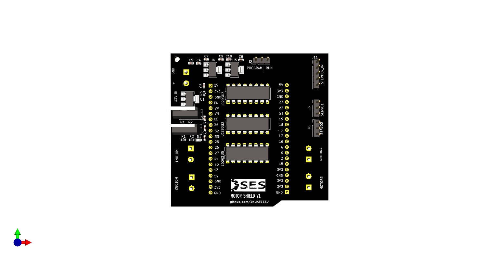

# SES-Board Motor Shield

---
The SES-Board Motor Shield features several outputs that can be useful to 
run motors for your projects needs. It features the following:
1. 2 servo motor control outputs
2. 4 DC motor control outputs
3. 1 stepper motor control output
4. External power supply
5. GPIO pins extension allowance
6. 3 LD293 Motor Driver ICs for high-current motor control
7. NEMA 17 stepper motor control 

The GPIO pins can be uses to connect to other sensors or outputs
you might want to control

# SES-Board Motor Shield Pin Assignments
The following table describes the pin assignment for each component
of the SES-Board motor shield:

|COMPONENT | PIN ON SESBOARD|
|---|---|
DC Motor 1
|IN1|34|
|IN2|35|
|IN3|32|
|IN4|33|
|ENA|25|
|ENB|26|
DC Motor 2 
IN5|23|
|IN6|22|
|IN7|21|
|IN8|19|
|ENC|18|
|END|5|
Servo 1
|SIG|17|
Servo 2
| SIG|16|
|(Stepper Motor)
|A+|12|
|A-|13|
|B+|14|
|B-|15|

*** For ESP32, pins 34-39 cannot support PWM***

# Screenshots
## Top

## Bottom

## Left

# References
1. [https://lastminuteengineers.com/l293d-dc-motor-arduino-tutorial/](https://lastminuteengineers.com/l293d-dc-motor-arduino-tutorial/)
2. [https://lastminuteengineers.com/stepper-motor-l293d-arduino-tutorial/](https://lastminuteengineers.com/stepper-motor-l293d-arduino-tutorial/)
3. [https://randomnerdtutorials.com/esp32-pinout-reference-gpios/#:~:text=The%20ESP32%20LED%20PWM%20controller,can't%20generate%20PWM)] (https://randomnerdtutorials.com/esp32-pinout-reference-gpios/#:~:text=The%20ESP32%20LED%20PWM%20controller,can't%20generate%20PWM)

